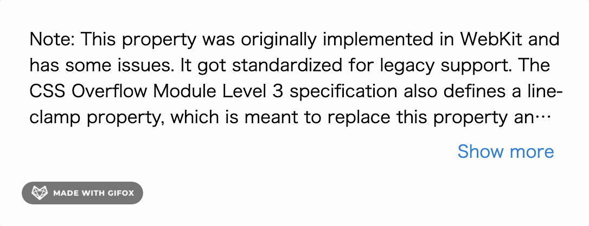

# show-more-text ( for vue.js 2.x)

[](https://www.npmjs.com/package/vue-show-more-text) [](https://www.npmjs.com/package/vue-show-more-text) [](https://www.npmjs.com/package/vue-show-more-text)

A simple vue multiline sentence ellipsis component for vue.js 2.x. The text in the component will be truncated automatically by line numbers, without specifying text max length.



## Installation

### NPM
```
$ npm install vue-show-more-text --save
```

### Run demo 
```
$ git clone https://github.com/limlt/show-more-text-demo
$ cd show-more-text-demo
$ npm install
$ npm run dev
```

## ShowMoreText Component Attributes

| Parameter        | Description           | Type               | Default       |  Required   |
|------------|----------------|--------------------|--------------|----------------|
| text | The string data that need to add ellipsis | String | -   | true |
| more-text | The anchor text that show more | String | Show less   | false |
| less-text | The anchor text that show less | String | Show more   | false |
| lines  | Number of lines to display | Number | 3  | false |
| has-more | Flag that show anchor | Boolean | true | false |
| additional-container-css | Addtional css for container | String| - | false |
| additional-content-css | Addtional css for content  | String | - | false |
| additional-content-expanded-css | Addtional css for content when expanded  | String | - | false |
| additional-anchor-css | Addtional css for anchor  | String | - | false |
| click | Anchor click callback function |  Function | - | false |

## How To Use

```

<template>
  <v-layout column justify-center align-center>
    <v-flex xs12 sm8 md6>
      <v-card>
        <v-card-text>
          <vue-show-more-text
            :text="txtString"
            :lines="4"
            additional-container-css="margin:14px;"
            additional-content-css="font-size:16px;"
            additional-content-expanded-css="font-size:16px;"
            additional-anchor-css="font-size: 16px;"
            @click="change"
          />
        </v-card-text>
      </v-card>
    </v-flex>
  </v-layout>
</template>

<script>
import vueShowMoreText from 'vue-show-more-text'
export default {
  components: {
    vueShowMoreText,
  },
  data() {
    return {
      txtString: `Note: This property was originally implemented in WebKit and has some issues. It got standardized for legacy support. The CSS Overflow Module Level 3 specification also defines a line-clamp property, which is meant to replace this property and avoid its issues.`,
    }
  },
  methods: {
    change(showAll) {
      console.log(showAll)
    },
  },
}
</script>


```


## License

[MIT](http://opensource.org/licenses/MIT)
